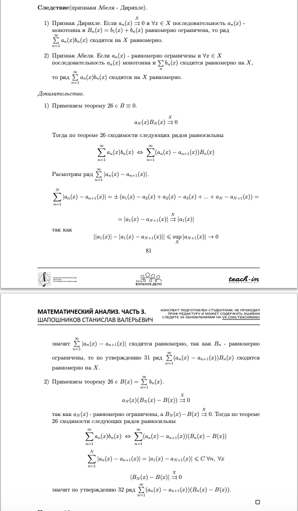

# Билеты, II семестр

## Билет №1
1. Достаточные условия дифференцируемости ФНП
   
2. Признаки Дирихле и Абеля равномерной сходимости ФР
   
   
   
## Билет №2
1. Дифференцируемость ФНП. Частные производные, производные по направлению, матрица Якоби.
   ![[Pasted image 20240526145047.png]]
   ![[Pasted image 20240526145252.png]]
   ![[Pasted image 20240526145345.png]]
   ![[Pasted image 20240526145703.png]]
2. Непрерывность суммы равномерного сходящегося ряда из непрерывных функций. Почленное интегрирование/дифференцирование ФР.
   ![[Pasted image 20240526150346.png]]
   ![[Pasted image 20240526150416.png]]
   ![[Pasted image 20240526153838.png]]
   ![[Pasted image 20240526153931.png]]
## Билет №3
1. Достаточное условие условного экстремума ФНП
   ![[Pasted image 20240526154837.png]]
   ![[Pasted image 20240526154948.png]]
   ![[Pasted image 20240526155100.png]]
   ![[Pasted image 20240526155134.png]]
2. Интегрируемость произведения интегрируемых функций. Интегрируемость модуля
   ![[Pasted image 20240526155809.png]]
   ![[Pasted image 20240526155949.png]]
   ![[Pasted image 20240526160038.png]]
   ![[Pasted image 20240526160128.png]]
   ![[Pasted image 20240526160155.png]]
   ![[Pasted image 20240526160555.png]]
   ![[Pasted image 20240526160613.png]]
## Билет №4
1. Инвариантность формы записи 1 дифференциала отображения
   ![[Pasted image 20240526160824.png]]
   ![[Pasted image 20240526160854.png]]
2. Признаки сравнения числовых рядов. Признаки Даламбера, Коши
  ![[Pasted image 20240526161540.png]]
  ![[Pasted image 20240526161804.png]]
  ![[Pasted image 20240526162728.png]]
  ![[Pasted image 20240526163112.png]]
  ![[Pasted image 20240526163153.png]]
  ![[Pasted image 20240526163238.png]]
## Билет №5
1. Непрерывность композиции непрерывных отображений. Теорема о промежуточных значениях для функции непрерывной в области
   ![[Pasted image 20240526164028.png]]
   ![[Снимок экрана 2024-05-26 в 16.58.29.png]]
2. Разложение функции (1 + x)α в ряд Тейлора
   ![[Pasted image 20240526170035.png]]
## Билет №6
1. Геометрический смысл дифференцируемости и градиента
   ![[Pasted image 20240526170132.png]]
2. Разложение в степенной ряд комплексной функции ez
   ![[Pasted image 20240526170305.png]]
## Билет №7
1. Дифференцируемое отображение, производная отображения. Необходимое условие дифференцируемости обратного отображения, достаточное условие дифференцируемости обратного отображения
   ![[Pasted image 20240526190912.png]]
   ![[Pasted image 20240526191002.png]]
   ![[Pasted image 20240526191325.png]]
   ![[Pasted image 20240526191502.png]]
2. Степенные ряды с комплексными членами. Круг и радиус сходимости. Характер сходимости в круге. Формула Коши-Адамара.
   ![[Pasted image 20240526192109.png]]
   ![[Pasted image 20240526192200.png]] ![[Pasted image 20240526192233.png]]
## Билет №8
1. Теорема об открытом отображении
   ![[Pasted image 20240526170713.png]]
2. Свойства интегралов с переменным верхним пределом. Формула Ньютона-Лейбница
   ![[Pasted image 20240526171202.png]]
   ![[Pasted image 20240526171907.png]]
   ![[Pasted image 20240526172008.png]]
## Билет №9
1. Предел последовательности точек в n-мерном пространстве. Связь между сходимостью покоординатно и по норме. Теорема Больцано-Вейерштрасса.
   ![[Pasted image 20240526183454.png]]
   ![[Pasted image 20240526183950.png]]
   ![[Pasted image 20240526184128.png]]
2. Бесконечная дифференцируемость суммы степенного ряда с действительными членами в интервале сходимости. Единственность представления функции степенным рядом
   ![[Pasted image 20240526184554.png]]
   ![[Pasted image 20240526184621.png]]

## Билет №10
1. Теорема о диффеоморфизме. Теорема о локальном диффеоморфизме. Продолжение до диффеоморфизма
   ![[Pasted image 20240526174013.png]]
   ![[Pasted image 20240526174120.png]]
   ![[Pasted image 20240526174229.png]]
2. Замена переменной и интегрирование по частям в определённом интеграле. 
   ![[Pasted image 20240526174330.png]]
   ![[Pasted image 20240526174421.png]]
## Билет №11
1. Теорема о неявном отображении как следствие теоремы о локальном диффеоморфизме
   ![[Pasted image 20240526172244.png]]
   ![[Pasted image 20240526172312.png]]
2. Достаточное условие аналитичности функции. Разложение в ряд ex, cosx, sinx, log(1 + x)
   ![[Pasted image 20240526172509.png]]
   ![[Pasted image 20240526172727.png]]
   ![[Pasted image 20240526172802.png]]
## Билет №12
1. Формула Тейлора с остаточным членом в форме Пеано и в форме Лагранжа для ФНП
2. Интегральный признак сходимости ЧР

## Билет №13
1. Необходимое условие условного экстремума
2. Линейность определённого интеграла. Аддитивность относительно отрезков интегрируемости

## Билет №14
1. Достаточное условие экстремума ФНП
2. Интегрируемость монотонной, непрерывной, кусочно-непрерывной функции как следствие из критерия Лебега

## Билет №15
1. Предел числовой ФНП. Предел функции по множеству, предел по направлению, повторный предел
2. Степенные ряды, I теорема Абеля, II теорема Абеля

## Билет №16
1. Формула Тейлора с остаточным членом в интегральной форме
2. Независимость суммы абсолютно сходящегося ряда от порядка слагаемых. Произведение абсолютно сходящихся рядов.

## Билет №17
1. Дифференцируемость композиции дифференцируемых отображений
2. Критерий Лебега интеграла Римана

## Билет №18
1. Достаточное условие независимости смешанной ЧП
2. Равномерная сходимость ФП и ФР. Критерий Коши. Признак Вейерштрасса

## Билет №19
1. Гладкие многообразия в Rn. Эквивалентные определения гладкого многообразия
2. Критерий Коши. Признак сравнения сходимости несобственных интегралов.

## Билет №20
1. Необходимые условия экстремума ФНП
2. Монотонность сумм Дарбу по разбиениям. Критерий интегрируемости.

## Билет №21
1. Касательное пространство к гладкому многообразию. Корректность определения
2. Признаки Дирихле и Абеля сходимости несобственных интегралов.

## Билет №22
1. Теорема Римана о перестановке членов условно-сходящегося ряда
2. Свойства функций непрерывных на компакте: ограниченность, достижимость точной верхней и нижней граней, равномерная непрерывность

## Билет №23
1. Геометрический смысл дифференцируемости и градиента
2. Понятие аналитичности в точке. Достаточное условие аналитичности. Пример неаналитичной в 0 бесконечно дифференцируемой функции.
